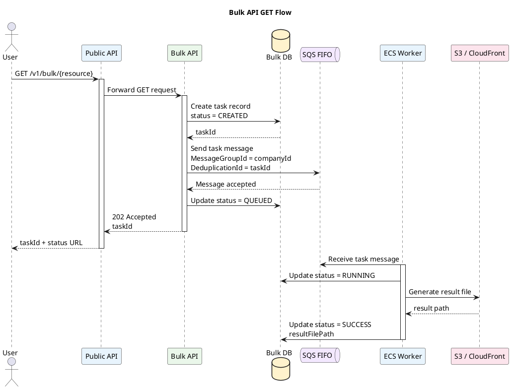
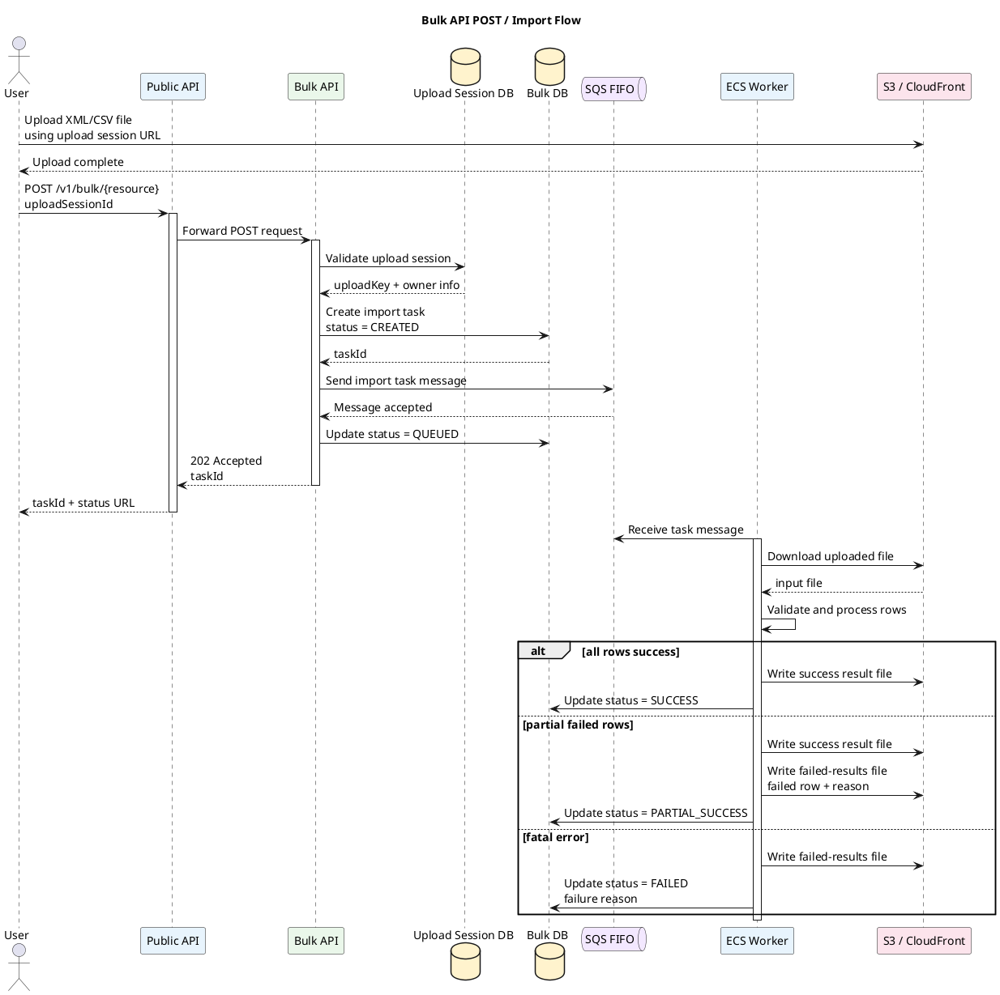
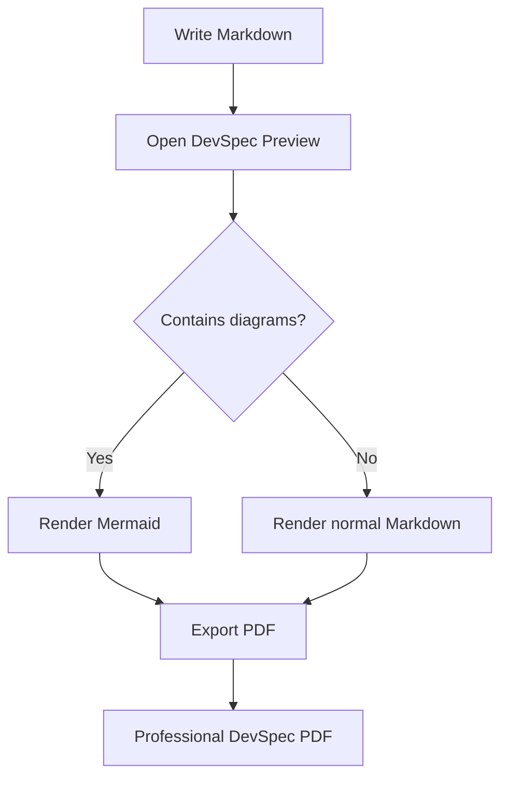
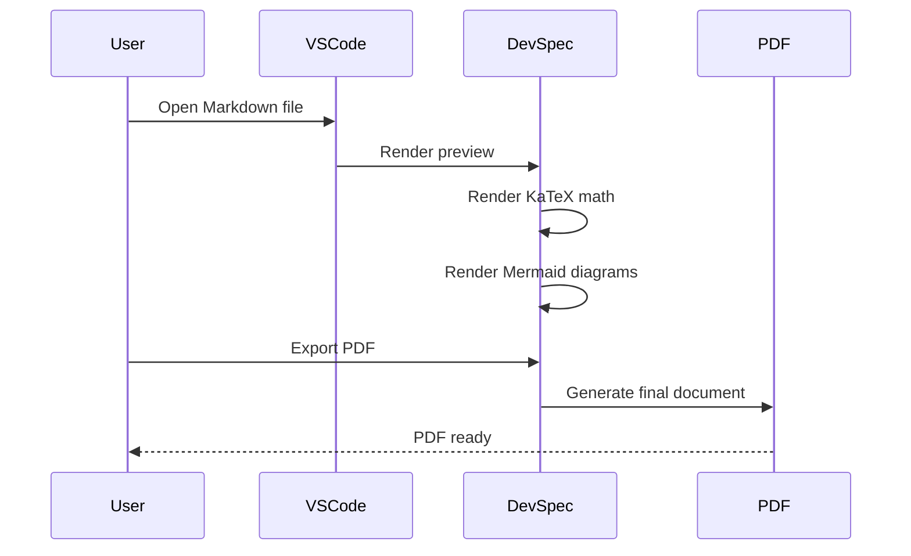
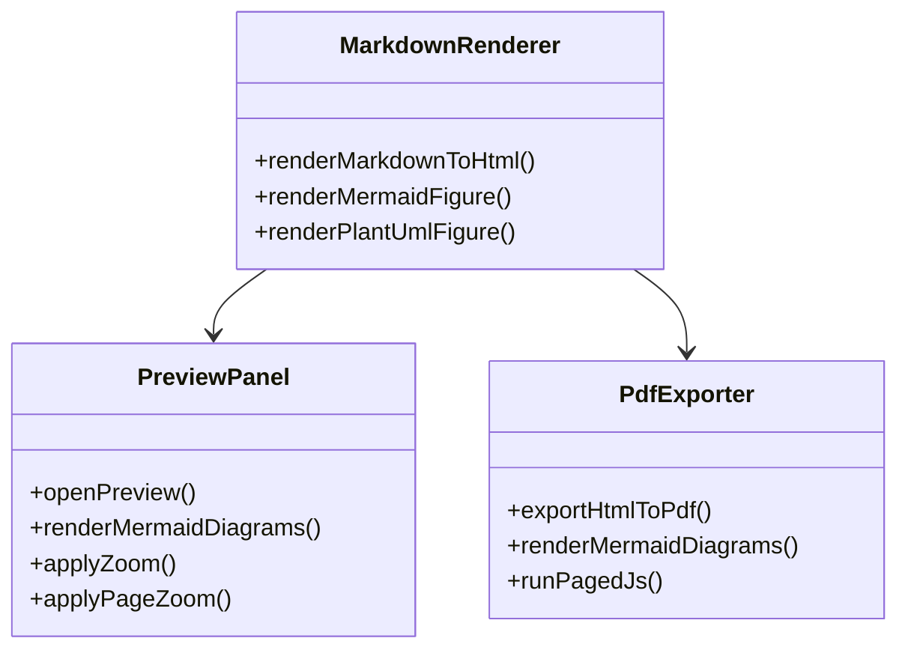
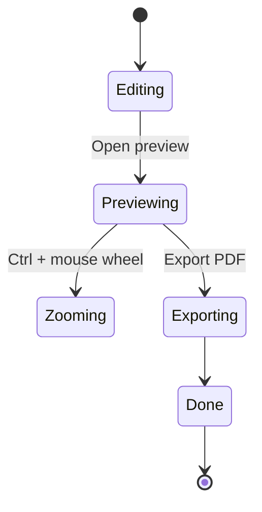
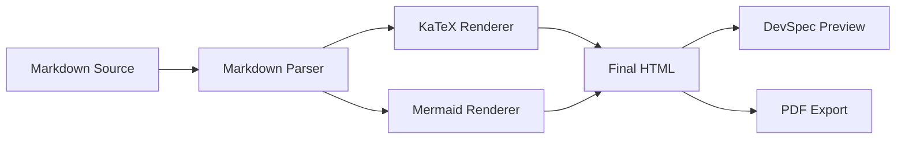

<!-- # {{DOC_TITLE}} -->
# <p align="center"> Bulk Api devspec embedded </p>

{{pagebreak}}

## Update History

| Version | Date       | Author       | Changes |
|---------|------------|--------------|----------|
| 1.0.0   | 2026-06-17 | Loc H. Duong | Initialize Version for Mardown and Plantuml|

## Introduction
This document is generated by Gradle.

This is **Hello World**, check _italic_

Generated diagram flow:
- PlantUML source files: `docs/diagrams/src/*.puml`
- SVG output: `build/generated-docs/diagrams/*.svg`
- Markdown output: `build/generated-docs/{{DOC_TITLE}}.md`
- PDF output: configured by `docs/doc-config.properties`

> [!NOTE]
> Useful information that users should know, even when skimming content.

> [!TIP]
> Helpful advice for doing things better or more easily.

> [!IMPORTANT]
> Key information users need to know to archive their goal.

> [!WARNING]
> Urgent info that needs immediate user attention to avoid problems.

> [!CAUTION]
> Advises about risks or negative outcomes of certain actions.

## GET Flow
### Overview Diagram



### How to write better code blocks now

* **Use this style:**

```java title="BulkTaskService.java"
public interface BulkTaskService {
    BulkCreateResponse createTask(BulkCreateRequest request);
}
```

* **SQL Example:**

```sql
-- ============================================================================
-- 1. DATABASE SETUP
-- ============================================================================
-- Create the database if it does not already exist
CREATE DATABASE IF NOT EXISTS CompanyDB;
USE CompanyDB;

-- ============================================================================
-- 2. TABLE SCHEMA CREATION (DDL)
-- ============================================================================

-- Create Departments Table (Parent Table)
CREATE TABLE IF NOT EXISTS departments (
    department_id INT AUTO_INCREMENT PRIMARY KEY,
    department_name VARCHAR(100) NOT NULL UNIQUE,
    location VARCHAR(100) DEFAULT 'Main Campus'
);

-- Create Employees Table (Child Table with Foreign Key)
CREATE TABLE IF NOT EXISTS employees (
    employee_id INT AUTO_INCREMENT PRIMARY KEY,
    first_name VARCHAR(50) NOT NULL,
    last_name VARCHAR(50) NOT NULL,
    email VARCHAR(100) UNIQUE,
    hire_date DATE NOT NULL,
    salary DECIMAL(10, 2) CHECK (salary > 0),
    department_id INT,
    status VARCHAR(20) DEFAULT 'Active',
    FOREIGN KEY (department_id) 
        REFERENCES departments(department_id)
        ON DELETE SET NULL
);

-- ============================================================================
-- 3. DATA POPULATION (DML)
-- ============================================================================

-- Insert Departments
INSERT INTO departments (department_name, location) VALUES 
('Engineering', 'Building A'),
('Human Resources', 'Building B'),
('Marketing', 'Remote');

-- Insert Employees
INSERT INTO employees (first_name, last_name, email, hire_date, salary, department_id) VALUES 
('Alice', 'Smith', 'alice.smith@company.com', '2023-01-15', 85000.00, 1),
('Bob', 'Johnson', 'bob.johnson@company.com', '2023-06-20', 92000.00, 1),
('Charlie', 'Brown', 'charlie.brown@company.com', '2024-02-10', 60000.00, 2),
('Diana', 'Prince', 'diana.prince@company.com', '2022-11-05', 75000.00, 3);

-- ============================================================================
-- 4. DATA UPDATES & MAINTENANCE
-- ============================================================================

-- Give a 5% raise to all engineers
UPDATE employees 
SET salary = salary * 1.05 
WHERE department_id = 1;

-- ============================================================================
-- 5. DATA QUERIES & REPORTING (DQL)
-- ============================================================================

-- Fetch average salary grouped by department name for active departments
SELECT 
    d.department_name,
    COUNT(e.employee_id) AS total_employees,
    ROUND(AVG(e.salary), 2) AS average_salary
FROM departments d
LEFT JOIN employees e ON d.department_id = e.department_id
WHERE e.status = 'Active'
GROUP BY d.department_name
ORDER BY average_salary DESC;
```

## 2. POST Flow



## Full Project Class Diagram

```plantuml name=class-diagram
@startuml
title Full Project Class Diagram - Bulk API

' Smetana usually avoids requiring Graphviz/dot for class diagram layout.
' If your local PlantUML ignores this and asks for Graphviz, install Graphviz.
!pragma layout smetana

skinparam classAttributeIconSize 0
skinparam shadowing false
skinparam packageStyle rectangle
skinparam linetype ortho
skinparam defaultFontSize 12

package "bulk-api-project" {

  package "porters.hr.api.bulk.controller" {
    class BulkTaskController {
      -bulkTaskService: BulkTaskService
      +createTask(request: BulkCreateRequest): BulkCreateResponse
      +getTaskStatus(taskId: String): BulkStatusResponse
      +getTaskResult(taskId: String): BulkResultResponse
      +abortTask(taskId: String): BulkAbortResponse
    }

    class BulkDownloadController {
      -downloadService: BulkDownloadService
      +createDownloadSession(taskId: String): DownloadSessionResponse
      +downloadResult(taskId: String, token: String): Resource
    }
  }

  package "porters.hr.api.bulk.service" {
    interface BulkTaskService {
      +createTask(request: BulkCreateRequest): BulkCreateResponse
      +getStatus(taskId: String): BulkStatusResponse
      +getResult(taskId: String): BulkResultResponse
      +abortTask(taskId: String): BulkAbortResponse
    }

    class BulkTaskServiceImpl {
      -taskRepository: BulkTaskRepository
      -sqsPublisher: BulkTaskQueuePublisher
      -storageService: StorageService
      +createTask(request: BulkCreateRequest): BulkCreateResponse
      +getStatus(taskId: String): BulkStatusResponse
      +getResult(taskId: String): BulkResultResponse
      +abortTask(taskId: String): BulkAbortResponse
    }

    interface BulkDownloadService {
      +createDownloadSession(taskId: String): DownloadSessionResponse
      +downloadResult(taskId: String, token: String): Resource
    }

    class BulkDownloadServiceImpl {
      -taskRepository: BulkTaskRepository
      -storageService: StorageService
      -tokenService: DownloadTokenService
      +createDownloadSession(taskId: String): DownloadSessionResponse
      +downloadResult(taskId: String, token: String): Resource
    }

    interface StorageService {
      +upload(key: String, content: byte[]): void
      +download(key: String): byte[]
      +exists(key: String): boolean
      +delete(key: String): void
    }

    class S3StorageService {
      -s3Client: S3Client
      -bucketName: String
    }

    class DownloadTokenService {
      +generateToken(taskId: String): String
      +validateToken(taskId: String, token: String): boolean
      +expireToken(token: String): void
    }
  }

  package "porters.hr.api.bulk.queue" {
    interface BulkTaskQueuePublisher {
      +publish(message: BulkTaskMessage): void
    }

    class SqsBulkTaskQueuePublisher {
      -sqsClient: SqsClient
      -queueUrl: String
      +publish(message: BulkTaskMessage): void
    }

    class BulkTaskMessage {
      -taskId: String
      -companyId: String
      -userId: String
      -resourceType: String
      -operationType: String
    }
  }

  package "porters.hr.api.bulk.worker" {
    class BulkTaskExecutor {
      -taskRepository: BulkTaskRepository
      -processorFactory: BulkProcessorFactory
      -storageService: StorageService
      +execute(taskId: String): void
    }

    class BulkProcessorFactory {
      -processors: List~BulkProcessor~
      +getProcessor(resourceType: String, operationType: String): BulkProcessor
    }

    interface BulkProcessor {
      +supports(resourceType: String, operationType: String): boolean
      +process(task: BulkTaskEntity): BulkProcessResult
    }

    class BulkImportProcessor {
      +process(task: BulkTaskEntity): BulkProcessResult
    }

    class BulkExportProcessor {
      +process(task: BulkTaskEntity): BulkProcessResult
      -fetchData(task: BulkTaskEntity): List~Object~
    }

    class BulkProcessResult {
      -successCount: int
      -failedCount: int
      -resultFilePath: String
      -failedResultFilePath: String
    }
  }

  package "porters.hr.api.bulk.repository" {
    interface BulkTaskRepository {
      +save(entity: BulkTaskEntity): BulkTaskEntity
      +findByTaskId(taskId: String): Optional~BulkTaskEntity~
      +updateStatus(taskId: String, status: BulkTaskStatus): void
      +updateResult(taskId: String, resultPath: String): void
      +updateFailure(taskId: String, reason: String): void
    }
  }

  package "porters.hr.api.bulk.entity" {
    class BulkTaskEntity {
      -taskId: String
      -companyId: String
      -userId: String
      -resourceType: String
      -operationType: String
      -status: BulkTaskStatus
      -inputFilePath: String
      -resultFilePath: String
      -failedResultFilePath: String
    }

    enum BulkTaskStatus {
      CREATED
      QUEUED
      RUNNING
      SUCCESS
      PARTIAL_SUCCESS
      FAILED
      ABORTED
    }
  }

  package "porters.hr.api.bulk.dto" {
    class BulkCreateRequest
    class BulkCreateResponse
    class BulkStatusResponse
    class BulkResultResponse
    class BulkAbortResponse
    class DownloadSessionResponse
  }
}

BulkTaskController --> BulkTaskService
BulkDownloadController --> BulkDownloadService

BulkTaskService <|.. BulkTaskServiceImpl
BulkDownloadService <|.. BulkDownloadServiceImpl
StorageService <|.. S3StorageService
BulkTaskQueuePublisher <|.. SqsBulkTaskQueuePublisher

BulkTaskServiceImpl --> BulkTaskRepository
BulkTaskServiceImpl --> BulkTaskQueuePublisher
BulkTaskServiceImpl --> StorageService

BulkDownloadServiceImpl --> BulkTaskRepository
BulkDownloadServiceImpl --> StorageService
BulkDownloadServiceImpl --> DownloadTokenService

SqsBulkTaskQueuePublisher --> BulkTaskMessage

BulkTaskExecutor --> BulkTaskRepository
BulkTaskExecutor --> BulkProcessorFactory
BulkTaskExecutor --> StorageService

BulkProcessorFactory --> BulkProcessor
BulkProcessor <|.. BulkImportProcessor
BulkProcessor <|.. BulkExportProcessor

BulkImportProcessor --> BulkProcessResult
BulkExportProcessor --> BulkProcessResult

BulkTaskRepository --> BulkTaskEntity
BulkTaskEntity --> BulkTaskStatus

BulkCreateResponse ..> BulkTaskEntity
BulkStatusResponse ..> BulkTaskEntity
BulkResultResponse ..> BulkTaskEntity

@enduml
```



## Notes

- The document title, version, owner, footer, output filename, and TOC title come from `docs/doc-config.properties`.
- The Table of Contents is generated automatically from Markdown headings.
- The Table of Contents page numbers are generated by Paged.js.
- Diagram placeholder values come from `placeholder.*` entries in `docs/doc-config.properties`.

---
## KaTeX Document
This file is used to test:

* Inline KaTeX math
* Block KaTeX math
* Matrix math
* Aligned equations
* Mermaid flowchart
* Mermaid sequence diagram
* Mermaid class diagram
* PDF export rendering

---
### Inline KaTeX Math
Einstein's formula is $E = mc^2$.

The quadratic formula is $x = \frac{-b \pm \sqrt{b^2 - 4ac}}{2a}$.

The cost is $100, so this dollar sign should not become math.

---
### Block KaTeX Math

$$
\int_0^1 x^2 , dx = \frac{1}{3}
$$

$$
\lim_{x \to 0} \frac{\sin x}{x} = 1
$$

---
### Matrix Test

$$
A =
\begin{bmatrix}
1 & 2 \
3 & 4
\end{bmatrix}
$$

$$
A^{-1}
=

\frac{1}{ad - bc}
\begin{bmatrix}
d & -b \
-c & a
\end{bmatrix}
$$

---
## Aligned Equation Test

$$
\begin{aligned}
f(x) &= x^2 + 2x + 1 \
&= (x + 1)^2
\end{aligned}
$$

---
## Mermaid Diagram Support
### Mermaid Flowchart



---
### Mermaid Sequence Diagram



---
### Mermaid Class Diagram



---
### Mermaid State Diagram



---
## Long Formula + Diagram Together
The normal distribution formula:

$$
f(x) =
\frac{1}{\sigma \sqrt{2\pi}}
e^{-\frac{1}{2}\left(\frac{x-\mu}{\sigma}\right)^2}
$$

