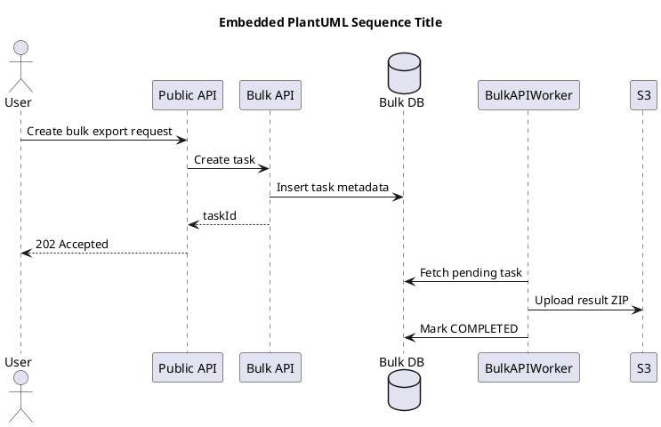

# <p align="center"> Markdown Full Syntax </p>
include::../config/devspec-properties.md[]

<<<
<!-- This is contents -->

This file is a **test document** for your Markdown → HTML → PDF pipeline.

It includes common Markdown syntax, GitHub-style extensions, code blocks with syntax highlighting, tables, footnotes, alerts, page breaks, and PlantUML examples.

---
This work will be display inside preview when we typing text. This is **good for our codebase**, please let me know if you want any supports and enhance current our features.

Hello Lam-san

## Paragraphs and line breaks

This is a normal paragraph. Markdown keeps text readable in source form and renders it as a paragraph in the final PDF.

This line ends with two spaces.  
This should render as a soft line break.

This line uses raw HTML `<br/>`.<br/>
This should render as a line break, not a new PDF page.

Use `{{pagebreak}}` or `<<<` for PDF page breaks, if your processor supports them.

---

## Inline formatting

Normal text.

*Italic text with asterisks*

_Italic text with underscores_

**Bold text with asterisks**

__Bold text with underscores__

***Bold and italic text***

~~Strikethrough text~~

`inline code`

Text with escaped Markdown characters: \*not italic\*, \# not heading, \[not link\].

A normal link: [OpenAI](https://openai.com)

Autolink: <https://example.com>

Email autolink: <test@example.com>

Raw HTML example: <kbd>Ctrl</kbd> + <kbd>C</kbd>

---

## Lists

### Unordered list

- PublicAPI
- BulkAPI
- PrivateAPI
  - Candidate
  - Client
  - Job
    - Nested level 3
    - Nested level 3 item 2
- Worker

### Ordered list

1. Create task
2. Save task metadata
3. Start worker
   1. Read task
   2. Call PrivateAPI
   3. Upload result to S3
4. Return status

### Task list

- [x] Render Markdown
- [x] Render PlantUML
- [x] Generate HTML
- [ ] Review generated PDF
- [ ] Publish DevSpec

---

## Blockquotes

> This is a normal blockquote.
>
> It can contain multiple paragraphs.

> Nested quote level 1
>
> > Nested quote level 2
> >
> > > Nested quote level 3

---

## GitHub-style alerts

> [!NOTE]
> Useful information that readers should know, even when skimming the document.

> [!TIP]
> Helpful advice for doing things better or more easily.

> [!IMPORTANT]
> Key information users need to know to achieve their goal.

> [!WARNING]
> Urgent information that needs immediate attention to avoid problems.

> [!CAUTION]
> Advises about risks or negative outcomes of certain actions.

---

## Tables

### Basic table

| Version | Date | Author | Changes |
|---|---|---|---|
| 1.0.0 | 2026-05-06 | Loc H. Duong | Initial DevSpec |
| 1.0.1 | 2026-06-18 | Loc H. Duong | Add full Markdown syntax test |

### Aligned table

| Left aligned | Center aligned | Right aligned |
|:---|:---:|---:|
| Candidate | Active | 120 |
| Client | Active | 35 |
| Job | Draft | 9 |

### Table with inline formatting

| Feature | Markdown |
|---|---|
| Bold | **supported** |
| Italic | *supported* |
| Inline code | `task_id` |
| Link | [example](https://example.com) |

---

## Definition list

PublicAPI
: External-facing API used by the client application.

BulkAPI
: Asynchronous API for import/export jobs.

PrivateAPI
: Internal API used by BulkAPI workers.

Worker
: Background process that reads tasks, generates files, and uploads results.

---

## Footnotes

Bulk API exports data asynchronously.[^bulk-export]

A temporary download URL should expire after a short time.[^download-session]

[^bulk-export]: The worker processes the request in the background and writes the result file to object storage.
[^download-session]: A download session should be short-lived and tied to the requesting user/company.

---

## Horizontal rule

Text before horizontal rule.

---

Text after horizontal rule.

***

Text after another horizontal rule.

---

## Code blocks

Use language names after the opening fence to activate syntax highlighting.

### Java

```java title="BulkTaskService.java"
public interface BulkTaskService {
    BulkCreateResponse createTask(BulkCreateRequest request);
    BulkTaskStatus getStatus(String taskId);
}
```

<!-- ### Java with line numbers

```java title="BulkTaskWorker.java" linenums
public class BulkTaskWorker {
    public void run(String taskId) {
        System.out.println("Start task: " + taskId);
        process(taskId);
    }

    private void process(String taskId) {
        // TODO: call PrivateAPI and upload result
    }
}
``` -->

### SQL

```sql title="bulk_task.sql"
CREATE DATABASE IF NOT EXISTS CompanyDB;
USE CompanyDB;

CREATE TABLE IF NOT EXISTS bulk_task (
    task_id VARCHAR(64) PRIMARY KEY,
    resource_name VARCHAR(64) NOT NULL,
    status VARCHAR(32) NOT NULL,
    created_at TIMESTAMP NOT NULL,
    updated_at TIMESTAMP NULL
);

INSERT INTO bulk_task (
    task_id,
    resource_name,
    status,
    created_at
) VALUES (
    'task-001',
    'candidate',
    'PENDING',
    CURRENT_TIMESTAMP
);
```

### JSON

```json title="bulk-create-request.json"
{
  "resource": "candidate",
  "operation": "export",
  "fields": ["id", "name", "email"],
  "filters": {
    "updatedAfter": "2026-01-01T00:00:00Z"
  }
}
```

### YAML

```yaml title="application.yml"
bulkapi:
  worker:
    concurrency: 4
    timeoutSeconds: 900
  s3:
    bucket: bulk-api-result-dev
```

### Bash

```bash title="run-docs.sh"
npm install
gradle clean generateDocs
```

### PowerShell

```powershell title="run-docs.ps1"
npm install
gradle clean generateDocs
```

### XML

```xml title="response.xml"
<response>
  <result>
    <taskId>task-001</taskId>
    <status>PENDING</status>
  </result>
</response>
```

### Plain text

```text
This is a plain text code block.
It should keep spacing and line breaks.
    Indented text stays indented.
```

---

## Images

A normal Markdown image example:


If external images are disabled in your PDF process, use local images instead:

```md

```

---

## Separated PlantUML file

This uses a separated PlantUML source file.

The file should exist at:

<!-- ```text
docs/diagrams/src/bulk-get-flow.puml
```

{{plantuml:bulk-get-flow}} -->

---

## Embedded PlantUML block

This PlantUML source is embedded directly in this Markdown file.


---
## Raw HTML
<div class="custom-box">
  <strong>Raw HTML block:</strong>
  Markdown processors with <code>html: true</code> should preserve this block.
</div>

<br/>

This line appears after an HTML line break.

---

## Manual page break

The next section should start on a new PDF page if your processor supports `{{pagebreak}}`.

{{pagebreak}}

## After manual page break

This section should be on a new PDF page.

You can also use AsciiDoc-like page break syntax if your processor supports it:

```text
<<<
```

---
## Special characters

Ampersand: &

Less than and greater than: < >

Quotes: "double quotes" and 'single quotes'

Japanese text: これは日本語のテストです。

Vietnamese text: Đây là kiểm tra tiếng Việt.

Emoji test: ✅ ⚠️ 💡
---

## Checklist for expected result

- [ ] Headings are automatically numbered if `sectnum.enabled=true`
- [ ] TOC has page numbers
- [ ] TOC entries are not too bold
- [ ] Code blocks are highlighted
- [ ] Tables look clean
- [ ] Alerts have different colors and icons
- [ ] PlantUML separated diagram renders
- [ ] PlantUML embedded diagram renders
- [ ] Page break works
- [ ] Header/footer theme is light and consistent
