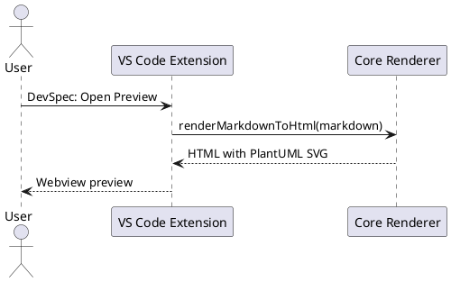

# <p align="center"> DevSpec Markdown Sample </p>

{{TOC}}

## Overview

This file tests the **monorepo extension structure**:

- `packages/core` renders Markdown.
- `packages/cli` exports HTML.
- `packages/vscode-extension` shows live preview.

> [!NOTE]
> This is a GitHub-style note alert.

> [!WARNING]
> If PlantUML jar is not configured, diagrams show a warning box instead of SVG.

## Tables

| Component | Purpose | Reused by CLI | Reused by VS Code |
| --- | --- | --- | --- |
| Core | Markdown engine | Yes | Yes |
| CLI | Terminal usage | Yes | No |
| VS Code extension | Preview panel | No | Yes |

## Code block

```ts title="core-example.ts"
import { renderMarkdownToHtml } from "@devspec-markdown/core";

const result = renderMarkdownToHtml({
  markdown: "# Hello",
  baseDir: process.cwd()
});

console.log(result.html);
```

## Embedded PlantUML

This test for vscode extension and **bold** format and *italic* format



## Manual page break

The next section starts after a page break in PDF output.

{{pagebreak}}

## After Page Break

This block verifies page-break syntax.

## Definition list

Core
: Reusable rendering logic.

CLI
: Command line wrapper.

VS Code extension
: Editor preview wrapper.

## Task list

- [x] Render Markdown
- [x] Render code blocks
- [x] Render PlantUML placeholders
- [ ] Add PDF export command inside VS Code
