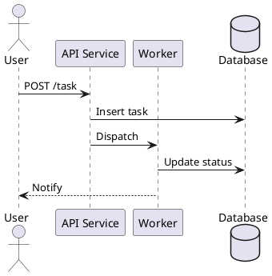
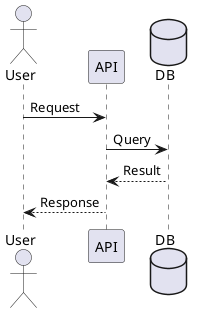

# <p align="center"> DevSpec Markdown Support for Visual Studio Code </p>

**DevSpec Markdown** is a VS Code extension for writing professional technical documentation in Markdown — with live preview, automatic table of contents, section numbering, PlantUML diagrams, syntax-highlighted code blocks, HTML export, and polished PDF output with custom headers, footers, and page numbers.

Built for engineering documents: development specifications, architecture records, API design notes, implementation summaries, runbooks, and internal technical reports.

:toc:

---
## Features

|                           |                                                                                       |
| ------------------------- | ------------------------------------------------------------------------------------- |
| 🖥️ **Live preview**        | Dedicated DevSpec preview panel with debounced auto-refresh                           |
| 📄 **HTML export**         | Export to a self-contained `.devspec.html` file                                       |
| 📑 **PDF export**          | Export to a print-ready `.devspec.pdf` with headers, footers, and page numbers        |
| 📋 **Table of contents**   | Auto-generated TOC from Markdown headings                                             |
| 🔢 **Section numbering**   | Automatic hierarchical heading numbers (`1.`, `1.1.`, `1.1.1.`)                       |
| 🌿 **PlantUML diagrams**   | Render embedded `plantuml` fences and separated `.puml` files                         |
| 🎨 **Syntax highlighting** | Language-tagged code blocks with highlight.js                                         |
| 🚨 **Markdown alerts**     | GitHub-style `[!NOTE]`, `[!TIP]`, `[!WARNING]`, `[!IMPORTANT]`, `[!CAUTION]`          |
| ⚙️ **Document attributes** | AsciiDoc-style `:key: value` directives for TOC, numbering, PDF metadata, and styling |
| 📁 **Shared config**       | Include a shared attribute file across multiple documents with `include::`            |
| 🎛️ **Custom stylesheet**   | Override the built-in CSS with your own stylesheet                                    |

---
## Requirements
- **Java** — required for PlantUML diagram rendering (`java` must be on your `PATH`)
- **Chromium-based browser** — required for PDF export (Edge, Chrome, Brave, or Chromium)

---
## Quick Start
**1. Create a Markdown file, e.g. `design.md`:**
````markdown
# Backend Service Design

:toc:
:toc-title: Table of Contents
:toclevels: 4

:sectnums:
:sectnumlevels: 4

:pdf-title: Backend Service Design
:pdf-owner: Engineering Team
:pdf-version: v1.0
:pdf-header-left: {title}
:pdf-header-right: {owner} · {version}
:pdf-footer-right: Page {page} / {totalPages}

## Overview
This document describes the backend service design.

## Architecture


## Implementation
Add implementation details here.
````

**2. Open the DevSpec preview:**
- Press `Ctrl+Alt+V` (macOS: `Cmd+Alt+V`), or
- Open the Command Palette (`Ctrl+Shift+P`) and run **DevSpec: Open Preview**

**3. Export to PDF:**
- Press `Ctrl+Alt+P` (macOS: `Cmd+Alt+P`), or
- Run **DevSpec: Export Current Markdown to PDF**

---
## Commands
Open a Markdown file, then run any of these commands from the Command Palette (`Ctrl+Shift+P`).

| Command                                      | Shortcut     | Description                                       |
| -------------------------------------------- | ------------ | ------------------------------------------------- |
| **DevSpec: Open Preview**                    | `Ctrl+Alt+V` | Open the live DevSpec preview beside the editor   |
| **DevSpec: Export Current Markdown to HTML** | —            | Export to `.devspec.html` next to the source file |
| **DevSpec: Export Current Markdown to PDF**  | `Ctrl+Alt+P` | Export to `.devspec.pdf` via a Save dialog        |

Commands are only available when a Markdown file is open in the active editor.

---
## Preview Zoom and Navigation

The DevSpec preview is designed for large engineering documents with wide tables and large PlantUML/Mermaid diagrams. The preview does not show a floating zoom toolbar; use mouse and keyboard gestures.

| Gesture | Behavior |
| --- | --- |
| `Ctrl + mouse wheel` over normal text | Zoom the Markdown content |
| `Ctrl + mouse wheel` over a diagram | Zoom only that diagram |
| `Ctrl + Alt + mouse wheel` anywhere in the preview | Zoom the whole preview page wrapper like a PDF viewer |
| `Ctrl + +` / `Ctrl + -` | Zoom content in / out |
| `Ctrl + 0` | Reset content zoom to 100% |
| `Ctrl + Alt + 0` | Reset page-wrapper zoom to 100% |

On macOS, use `Cmd` where the shortcut uses `Ctrl`.

### Choosing the right zoom mode
Use **content zoom** when you want the document text and tables to become easier to read. Use **diagram zoom** when a single class diagram or sequence diagram is too small but the surrounding document is already readable. Use **page-wrapper zoom** when you want the entire preview surface to behave more like a PDF viewer page, including the document page, content, tables, and diagrams.

Zoom state is preserved while the preview webview is alive. Reopening the preview starts from the configured `devspecMarkdown.previewZoomLevel`.

---
## Document Attributes
DevSpec Markdown reads AsciiDoc-style `:key: value` directives placed anywhere in the document (typically near the top). Directive lines are stripped before rendering — they never appear in the output.

```markdown
:key:               → boolean true
:key: value         → string or number
:key: false         → boolean false
:!key!:             → boolean false (alternative syntax)
```

### Table of Contents
```markdown
:toc:
:toc-title: Table of Contents
:toclevels: 4
```

| Attribute            | Type   | Description                                                                                                  |
| -------------------- | ------ | ------------------------------------------------------------------------------------------------------------ |
| `:toc:`              | bool   | Enable table of contents (insert `[[TOC]]` or `{{TOC}}` at the desired position, or omit for auto-placement) |
| `:toc-title: <text>` | string | Heading text above the TOC list                                                                              |
| `:toclevels: <n>`    | number | Maximum heading depth to include in the TOC (default: all levels)                                            |

* **Example document with TOC positioned manually:**
```markdown
# My Document

:toc:
:toc-title: Contents
:toclevels: 3

## Overview

## Design

### Component A

### Component B
```

### Section Numbering
```markdown
:sectnums:
:sectnumlevels: 4
```

| Attribute             | Type   | Description                        |
| --------------------- | ------ | ---------------------------------- |
| `:sectnums:`          | bool   | Enable automatic section numbering |
| `:sectnumlevels: <n>` | number | Maximum heading depth to number    |

* **To disable numbering within a document:**
```markdown
:sectnums: false
```

or:
```markdown
:!sectnums!:
```

* **Example output with `sectnums` enabled:**
```
1. Overview
2. Design
  2.1. Component A
  2.2. Component B
    2.2.1. Sub-component
```

### Layout
| Attribute            | Type   | Description                                         |
| -------------------- | ------ | --------------------------------------------------- |
| `:noheader:`         | bool   | Hide the page header in preview and PDF             |
| `:nofooter:`         | bool   | Hide the page footer in preview and PDF             |
| `:imagesdir: <path>` | string | Base directory for resolving relative image paths   |
| `:icons:`            | string | Enable icon set (use `font` for Font Awesome icons) |

### Styling
| Attribute                  | Type   | Description                                                           |
| -------------------------- | ------ | --------------------------------------------------------------------- |
| `:stylesdir: <path>`       | string | Directory containing the custom stylesheet (relative to the document) |
| `:stylesheet: <file>`      | string | CSS file to append after the built-in stylesheet                      |
| `:source-highlighter:`     | string | Syntax highlighter hint (e.g. `highlight.js`)                         |
| `:source-language: <lang>` | string | Default language for unlabelled code fences                           |

Custom stylesheet example:
```markdown
:stylesdir: docs/styles
:stylesheet: my-theme.css
```

---
## PDF Headers and Footers
Each PDF header and footer has three independent slots: **left**, **center**, and **right**.

```markdown
:pdf-title: My Document
:pdf-owner: Engineering Team
:pdf-version: v1.0

:pdf-header-left: {title}
:pdf-header-center:
:pdf-header-right: {owner} · {version}

:pdf-footer-left:
:pdf-footer-center:
:pdf-footer-right: Page {page} / {totalPages}
```

### PDF Metadata Attributes
| Attribute                       | Description                                          |
| ------------------------------- | ---------------------------------------------------- |
| `:pdf-title: <text>`            | Document title — used in header/footer via `{title}` |
| `:pdf-owner: <text>`            | Owner or team name — used via `{owner}`              |
| `:pdf-version: <text>`          | Version string — used via `{version}`                |
| `:pdf-show-header: true\|false` | Show or hide the header (overrides `:noheader:`)     |
| `:pdf-show-footer: true\|false` | Show or hide the footer (overrides `:nofooter:`)     |

### Header and Footer Slot Attributes
Replace `header`/`footer` and `left`/`center`/`right` as needed.

| Attribute                             | Description                                   |
| ------------------------------------- | --------------------------------------------- |
| `:pdf-header-left: <text>`            | Left header slot content                      |
| `:pdf-header-center: <text>`          | Center header slot content                    |
| `:pdf-header-right: <text>`           | Right header slot content                     |
| `:pdf-footer-left: <text>`            | Left footer slot content                      |
| `:pdf-footer-center: <text>`          | Center footer slot content                    |
| `:pdf-footer-right: <text>`           | Right footer slot content                     |
| `:pdf-header-left-font-size: <css>`   | Font size for left header slot (e.g. `14px`)  |
| `:pdf-header-left-font-weight: <css>` | Font weight for left header slot (e.g. `700`) |

The same `-font-size` and `-font-weight` attributes are available for all six slots.

### Placeholders
Placeholders in header and footer slot values are replaced at render time.

| Placeholder    | Resolves to                        |
| -------------- | ---------------------------------- |
| `{title}`      | `:pdf-title:` value                |
| `{owner}`      | `:pdf-owner:` value                |
| `{version}`    | `:pdf-version:` value              |
| `{fileName}`   | Source `.md` file name             |
| `{page}`       | Current page number                |
| `{totalPages}` | Total number of pages              |
| `{docname}`    | Source file name without extension |
| `{docfile}`    | Absolute path of the source file   |
| `{docdate}`    | File last-modified date            |
| `{localdate}`  | Today's date                       |

---
## Shared Configuration Files
Keep common attributes in a shared file and pull it into any document with an `include::` directive.

**Recommended structure:**
```
docs/
├─ config/
│  └─ devspec-properties.md
└─ templates/
   └─ design-document.md
```

**`docs/config/devspec-properties.md`:**
```markdown
:toc:
:toc-title: Table of Contents
:toclevels: 4

:sectnums:
:sectnumlevels: 4

:pdf-owner: Engineering Team
:pdf-version: v1.0

:pdf-header-left: {title}
:pdf-header-right: {owner} · {version}
:pdf-footer-right: Page {page} / {totalPages}
```

**`docs/templates/design-document.md`:**

```markdown
include::../config/devspec-properties.md[]

:pdf-title: Backend Service Design

# Backend Service Design
## Overview
```
Paths in `include::` are resolved relative to the file that contains the directive.

---
## PlantUML Diagrams
Embed PlantUML diagrams directly in a `plantuml` (or `puml`) fenced block:
````markdown

````

Diagrams are rendered in the DevSpec preview, HTML export, and PDF export.

For separated `.puml` files, place them in `docs/diagrams/src/` and reference them inline:
```markdown
{{plantuml:my-sequence-diagram}}
```

> **Note:** Java must be installed and on your `PATH` for PlantUML rendering to work.
> You can configure a custom `plantuml.jar` path via the `devspecMarkdown.plantumlJarPath` setting if the bundled jar is not used.

---
## Syntax-Highlighted Code Blocks
Use standard fenced code blocks with a language tag:
````markdown
```java
public class Example {
    public static void main(String[] args) {
        System.out.println("Hello DevSpec");
    }
}
```
````

**Features:**
- Language badge shown above each block
- Syntax highlighting via highlight.js (100+ languages)
- PDF-friendly line wrapping for long lines
- Smart page splitting for large code blocks
- Inline code and long file paths wrapped correctly in PDF

---
## Markdown Alerts
GitHub-style alert blocks are fully supported:

```markdown
> [!NOTE]
> Useful information for the reader.

> [!TIP]
> A helpful recommendation or best practice.

> [!IMPORTANT]
> Critical information that must not be missed.

> [!WARNING]
> Content that requires careful attention.

> [!CAUTION]
> Risky or potentially harmful actions to avoid.
```

---
## Page Breaks
Insert a manual page break in the PDF output:
```markdown
{{pagebreak}}
```

or:
```markdown
{{page-break}}
```

HTML comment and AsciiDoc-style page breaks are also supported:
```markdown
<!-- pagebreak -->

<<<
```
---
## PDF Export
PDF export renders your document through a local Chromium-based browser using Puppeteer. No cloud service or external account is required.

**Supported browsers (auto-detected):**
- Microsoft Edge
- Google Chrome
- Brave Browser
- Chromium

The extension searches for a browser using the following priority order:
1. `devspecMarkdown.browserPath` VS Code setting
2. `DEVSPEC_BROWSER_PATH`, `PUPPETEER_EXECUTABLE_PATH`, `CHROME_PATH`, or `EDGE_PATH` environment variables
3. Common install paths (Windows Program Files / LocalAppData, macOS `/Applications`, Linux `/usr/bin`, `/snap/bin`)
4. Windows Registry `App Paths` keys
5. System `PATH`

Most users do not need to configure anything manually.

### Custom Browser Path
If auto-detection fails, set the browser path explicitly in your VS Code settings:

**Windows:**
```json
{
  "devspecMarkdown.browserPath": "C:/Program Files/Microsoft/Edge/Application/msedge.exe"
}
```

**macOS:**
```json
{
  "devspecMarkdown.browserPath": "/Applications/Google Chrome.app/Contents/MacOS/Google Chrome"
}
```

**Linux:**
```json
{
  "devspecMarkdown.browserPath": "/usr/bin/chromium"
}
```

### System Dependency check and installation
DevSpec Markdown can check whether the current environment has the required system dependencies for preview, PlantUML rendering, and PDF export.

The extension can check for:
* Java runtime
* FreeType
* Fontconfig
* Fonts
* Graphviz
* Chromium-based browser

When the extension starts, it can automatically check dependencies if this setting is enabled:
```json
{ 
  "devspecMarkdown.autoCheckDependencies": true
}
```
If dependencies are missing, the extension shows a prompt:

```
DevSpec Markdown needs additional dependencies... 
[Install Dependencies] [Show Details] [Don't Show Again]
```

### Supported environments

```
Windows             → winget
macOS               → brew
Debian / Ubuntu     → apt-get
Amazon Linux 2023   → dnf with amzn-specific package names
Fedora / RHEL-like  → dnf or yum
Alpine              → apk
Arch / Manjaro      → pacman
openSUSE / SUSE     → zypper
```

>[!NOTE]
> Because installing packages changes the user's machine/container
> So we should do:
> * Automatic check: yes
> * Automatic prompt: yes
> * One-click install: yes
> * Silent install without permission: no

---
## Dev Container Usage
When VS Code runs inside a Dev Container, the extension runs inside the container too. The browser installed on your host machine (Windows or macOS) is not accessible.

### Check OS and package manager
Run inside Dev Container:
```bash
cat /etc/os-release
```

If you see Debian/Ubuntu, use `apt`, `dpkg`, `dpkg-query`.

### Check whether required package are installed
For your DevSpec extension, check these:
```bash
dpkg -l | grep -E "libfreetype6|fontconfig|fonts-dejavu-core|fonts-noto-cjk|graphviz|chromium"
```

More precies:
```bash
dpkg-query -W -f='${Package} ${Status}\n' \
  libfreetype6 \
  fontconfig \
  fonts-dejavu-core \
  fonts-noto-cjk \
  graphviz \
  chromium
```

### Install Chromium inside the container image
```dockerfile
RUN apt-get update \
  && apt-get install -y --no-install-recommends \
    libfreetype6 \
    fontconfig \
    fonts-dejavu-core \
    fonts-noto-cjk \
    graphviz \
    chromium \
  && rm -rf /var/lib/apt/lists/* \
  && ldconfig
```

---
## Extension Settings

All settings use the prefix `devspecMarkdown.` and can be set in VS Code's Settings UI or `settings.json`.

| Setting                       | Default             | Description                                                                                    |
| ----------------------------- | ------------------- | ---------------------------------------------------------------------------------------------- |
| `diagramSourceDir`            | `docs/diagrams/src` | Directory for separated `.puml` source files (relative to project root or absolute)            |
| `plantumlJarPath`             | *(empty)*           | Path to `plantuml.jar`. When empty, the bundled jar in `packages/core/vendor/` is used         |
| `plantumlSecurityProfile`     | `SECURE`            | PlantUML security profile. Use `UNSECURE` only when remote `!include` is required              |
| `previewDebounceMs`           | `700`               | Milliseconds to wait after a keystroke before refreshing the preview                           |
| `sectionNumbering`            | `true`              | Enable automatic heading numbering globally (can be overridden per-document with `:sectnums:`) |
| `sectionNumberMinLevel`       | `2`                 | Minimum heading level to number (`2` = `h2` and deeper)                                        |
| `sectionNumberMaxLevel`       | `4`                 | Maximum heading level to number                                                                |
| `stripExistingSectionNumbers` | `true`              | Remove manually written section numbers before generating automatic ones                       |
| `browserPath`                 | *(empty)*           | Override browser executable path for PDF export                                                |

---

## Troubleshooting
### PDF export cannot find a browser

Install a Chromium-based browser (Edge, Chrome, Brave, or Chromium), or set the path manually:
```json
{ "devspecMarkdown.browserPath": "/path/to/browser" }
```

If you are using a Dev Container, see [Dev Container Usage](#dev-container-usage).

---
### PDF export works locally but fails inside a Dev Container

The extension runs inside the container and cannot reach the host browser. Install Chromium inside the container:
```dockerfile
RUN apt-get update \
    && apt-get install -y --no-install-recommends chromium \
    && rm -rf /var/lib/apt/lists/*
```

```json
{ "devspecMarkdown.browserPath": "/usr/bin/chromium" }
```

---
### PlantUML diagrams do not render
Ensure `java` is installed and available on your `PATH`:
```sh
java -version
```

If you want to use a specific `plantuml.jar`:
```json
{ "devspecMarkdown.plantumlJarPath": "C:/tools/plantuml/plantuml.jar" }
```

If your diagrams use remote `!include` directives, set the security profile:
```json
{ "devspecMarkdown.plantumlSecurityProfile": "UNSECURE" }
```

---
### Preview is slow on large documents
Increase the debounce delay to reduce re-render frequency while typing:
```json
{ "devspecMarkdown.previewDebounceMs": 1500 }
```

---
### Section numbers appear twice
This happens when a document already contains manually written numbers. Enable automatic cleanup:
```json
{ "devspecMarkdown.stripExistingSectionNumbers": true }
```

Or disable numbering for that document:
```markdown
:!sectnums!:
```

---
### Long file paths or code lines overflow the PDF page
Wrap file paths in inline code — DevSpec Markdown applies PDF-friendly wrapping automatically:
```markdown
File: `/workspaces/project/src/main/java/com/example/service/VeryLongName.java`
```

---
## License
MIT
