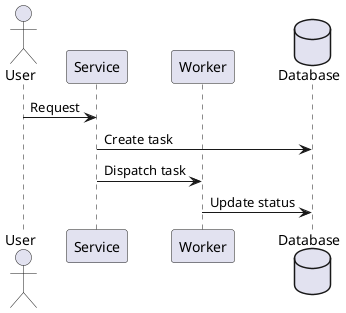
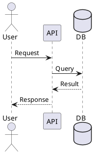

# DevSpec Markdown

**DevSpec Markdown** is a VS Code extension for writing professional technical documentation in Markdown.

It provides a dedicated DevSpec preview, table of contents generation, section numbering, PlantUML diagram rendering, syntax-highlighted code blocks, HTML export, and polished PDF export with headers, footers, and page numbers.

This extension is designed for engineering documents such as development specifications, architecture documents, API design notes, implementation summaries, runbooks, and internal technical reports.

## Features

* Live DevSpec preview for Markdown files
* Professional HTML export
* Professional PDF export
* Automatic table of contents
* Automatic section numbering
* PDF headers and footers
* PDF page numbers
* PlantUML diagram rendering
* Syntax-highlighted code blocks
* GitHub-style Markdown alerts
* DevSpec-style document attributes
* Shared document configuration through `include::...[]`
* Long text, long file path, and long code-line handling for PDF export
* Works with normal `.md` Markdown files

## Commands

Open a Markdown file, then run one of these commands from the VS Code Command Palette.

| Command                                    | Description                                                 |
| ------------------------------------------ | ----------------------------------------------------------- |
| `DevSpec: Open Preview`                    | Open the DevSpec live preview for the current Markdown file |
| `DevSpec: Export Current Markdown to HTML` | Export the current Markdown file to `.devspec.html`         |
| `DevSpec: Export Current Markdown to PDF`  | Export the current Markdown file to `.devspec.pdf`          |

## Quick Start

Create a Markdown file:

````md
# Backend Implementation Summary

:toc:
:toc-title: Table of Contents
:toclevels: 4

:sectnums:
:sectnumlevels: 4

:pdf-title: Backend Implementation Summary
:pdf-owner: Engineering Team
:pdf-version: v1.0
:pdf-header-left: {title}
:pdf-header-right: {owner} · {version}
:pdf-footer-right: Page {page} / {totalPages}

## Overview

This document describes the implementation design.

## Architecture



To export PDF:
```text
DevSpec: Export Current Markdown to PDF
```

## Document Attributes
DevSpec Markdown supports document attributes inside Markdown files.

Place attributes near the top of your document.

```md
:toc:
:toc-title: Table of Contents
:toclevels: 4

:sectnums:
:sectnumlevels: 4

:pdf-title: My Document
:pdf-owner: Engineering Team
:pdf-version: v1.0

:pdf-header-left: {title}
:pdf-header-center:
:pdf-header-right: {owner} · {version}

:pdf-footer-left:
:pdf-footer-center:
:pdf-footer-right: Page {page} / {totalPages}
```

## Table of Contents

Enable table of contents:

```md
:toc:
:toc-title: Table of Contents
:toclevels: 4
```

The table of contents is generated from Markdown headings.

Example:

```md
# My Document

:toc:
:toc-title: Table of Contents
:toclevels: 4

## Overview

## Design

### Component A

### Component B
```

## Section Numbering

Enable automatic section numbering:

```md
:sectnums:
:sectnumlevels: 4
```

Disable section numbering:

```md
:sectnums: false
```

or:

```md
:sectnums!:
```

Example output:

```text
1. Overview
2. Design
2.1. Component A
2.2. Component B
```

## PDF Header and Footer

PDF export supports custom headers and footers.

```md
:pdf-title: My Document
:pdf-owner: Engineering Team
:pdf-version: v1.0

:pdf-header-left: {title}
:pdf-header-center:
:pdf-header-right: {owner} · {version}

:pdf-footer-left:
:pdf-footer-center:
:pdf-footer-right: Page {page} / {totalPages}
```

Supported placeholders:

| Placeholder    | Description               |
| -------------- | ------------------------- |
| `{title}`      | PDF title                 |
| `{owner}`      | PDF owner or team         |
| `{version}`    | PDF version               |
| `{fileName}`   | Source Markdown file name |
| `{page}`       | Current page number       |
| `{totalPages}` | Total number of pages     |

## Shared Configuration Files

You can keep common document attributes in a shared Markdown config file.

Recommended structure:

```text
docs/
├─ config/
│  └─ devspec-properties.md
└─ templates/
   └─ design-document.md
```

Example `docs/config/devspec-properties.md`:

```md
:toc:
:toc-title: Table of Contents
:toclevels: 4

:sectnums:
:sectnumlevels: 4

:pdf-owner: Engineering Team
:pdf-version: v1.0
:pdf-header-left: {title}
:pdf-header-right: {owner} · {version}
:pdf-footer-right: Page {page} / {totalPages}
```

Example `docs/templates/design-document.md`:

```md
# Design Document

include::../config/devspec-properties.md[]

## Overview

Document content starts here.
```

The include path is resolved relative to the Markdown file that contains the `include::...[]` directive.

## PlantUML Support

DevSpec Markdown supports PlantUML code fences.

````md

````

PlantUML diagrams are rendered in preview, HTML export, and PDF export.

## Code Blocks

DevSpec Markdown supports syntax-highlighted code blocks.

````md
```java
public class Example {
    public static void main(String[] args) {
        System.out.println("Hello DevSpec");
    }
}
```
````

Supported behavior:

* Syntax highlighting
* Language badge
* PDF-friendly line wrapping
* Page splitting for long code blocks
* Long file path and long code-line handling

## Markdown Alerts

GitHub-style Markdown alerts are supported.

```md
> [!NOTE]
> Useful information for readers.

> [!TIP]
> A recommendation or best practice.

> [!WARNING]
> Something that needs attention.

> [!IMPORTANT]
> Important information that should not be missed.

> [!CAUTION]
> Risky or dangerous behavior to avoid.
```

## PDF Export
PDF export uses a local Chromium-based browser through Puppeteer.

The extension automatically tries to detect:
* Microsoft Edge
* Google Chrome
* Brave Browser
* Chromium

The browser detection checks:
* VS Code setting override
* Environment variables
* Common Windows, macOS, and Linux install paths
* Windows Registry App Paths
* System `PATH`

Most users do not need to configure a browser path manually.

### Optional Browser Override
If automatic detection fails, configure the browser executable path manually.

Windows example:
```json
{
  "devspecMarkdown.browserPath": "C:/Program Files/Microsoft/Edge/Application/msedge.exe"
}
```

Linux example:
```json
{
  "devspecMarkdown.browserPath": "/usr/bin/chromium"
}
```

macOS example:
```json
{
  "devspecMarkdown.browserPath": "/Applications/Google Chrome.app/Contents/MacOS/Google Chrome"
}
```

## Dev Container Usage
When VS Code is opened inside a Dev Container, workspace extensions run inside the container environment.

That means PDF export cannot use Chrome or Edge installed on your Windows or macOS host machine. A browser must be installed inside the container.

For Debian or Ubuntu-based containers:

```dockerfile
RUN apt-get update \
    && apt-get install -y --no-install-recommends chromium \
    && rm -rf /var/lib/apt/lists/*
```

Then configure:
```json
{
  "devspecMarkdown.browserPath": "/usr/bin/chromium"
}
```

## Extension Settings

| Setting                                       |             Default | Description                                                       |
| --------------------------------------------- | ------------------: | ----------------------------------------------------------------- |
| `devspecMarkdown.diagramSourceDir`            | `docs/diagrams/src` | Directory for separated PlantUML source files                     |
| `devspecMarkdown.plantumlJarPath`             |               empty | Optional path to `plantuml.jar`                                   |
| `devspecMarkdown.plantumlSecurityProfile`     |            `SECURE` | PlantUML security profile                                         |
| `devspecMarkdown.previewDebounceMs`           |               `700` | Delay before refreshing live preview while typing                 |
| `devspecMarkdown.sectionNumbering`            |              `true` | Enable automatic heading numbering                                |
| `devspecMarkdown.sectionNumberMinLevel`       |                 `2` | Minimum heading level for numbering                               |
| `devspecMarkdown.sectionNumberMaxLevel`       |                 `4` | Maximum heading level for numbering                               |
| `devspecMarkdown.stripExistingSectionNumbers` |              `true` | Remove existing manual section numbers before generating new ones |
| `devspecMarkdown.browserPath`                 |               empty | Optional browser executable path for PDF export                   |

### PDF export cannot find a browser

Install one of the following browsers:

- Microsoft Edge
- Google Chrome
- Brave Browser
- Chromium

If you are using a Dev Container, install Chromium inside the container.

### PDF export works locally but not in Dev Container
Install Chromium inside the container:
```dockerfile
RUN apt-get update \
    && apt-get install -y --no-install-recommends chromium \
    && rm -rf /var/lib/apt/lists/*
```

Then set:
```json
{
  "devspecMarkdown.browserPath": "/usr/bin/chromium"
}
```

### PlantUML diagrams do not render
Check that Java is installed and PlantUML is available.

You can configure:
```json
{
  "devspecMarkdown.plantumlJarPath": "C:/tools/plantuml/plantuml.jar"
}
```

### Preview is slow for large documents
Increase the preview debounce time:
```json
{
  "devspecMarkdown.previewDebounceMs": 1200
}
```

### Section numbers appear twice
Enable existing number cleanup:
```json
{
  "devspecMarkdown.stripExistingSectionNumbers": true
}
```

or disable numbering in the document:
```md
:sectnums: false
```

### Long file paths overflow in PDF
Use inline code for file paths:
```md
File: `/workspaces/project/src/main/java/example/VeryLongPath.java`
```

DevSpec Markdown applies PDF-friendly wrapping for long paths and inline code.

## Known Limitations
* PDF export requires an installed Chromium-based browser.
* Dev Container PDF export requires a browser inside the container.
* Very large diagrams may be scaled to fit the PDF page width.
* Remote PlantUML includes may require changing the PlantUML security profile.
* Extremely wide tables may need manual column design for best PDF output.

## Release Notes

### 0.0.2

* Improved browser auto-detection for PDF export
* Improved PDF export support for another machine installation
* Improved Dev Container PDF export error message
* Improved long text and code block wrapping in PDF
* Improved code block pagination and spacing

### 0.0.1

* Initial DevSpec Markdown preview
* HTML export
* PDF export
* Table of contents
* Section numbering
* PlantUML support

## License

MIT
